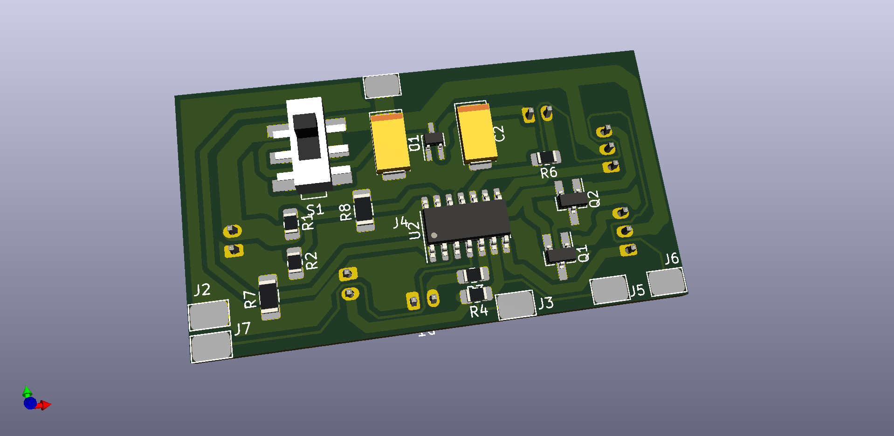
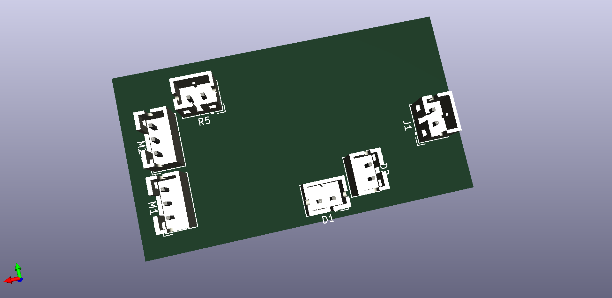

# 2021-Pumpkin-Haro

2021 Pumpkin Contest, Haro from Gundam. His Eyes will light up and emote. Linear servos move the Ears up and down to flap.
### BOM
* ATTINY84
* 2x NPN Transistor
* LM1117 3.3V
* 3x ? ohm Resistor
* 2x 10M ohm Resistor
* 2x Capacitor
* 2x 0 ohm Resistor
* Slide Switch
* 4x 2-Pin JST 
* 2x 3-Pin JST
* 2x Red LED
* 2x Linear Servo Motor
* LDR
* Li-on Battery

